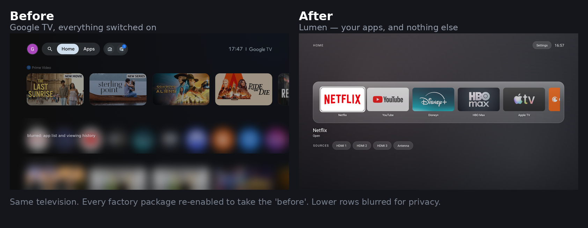
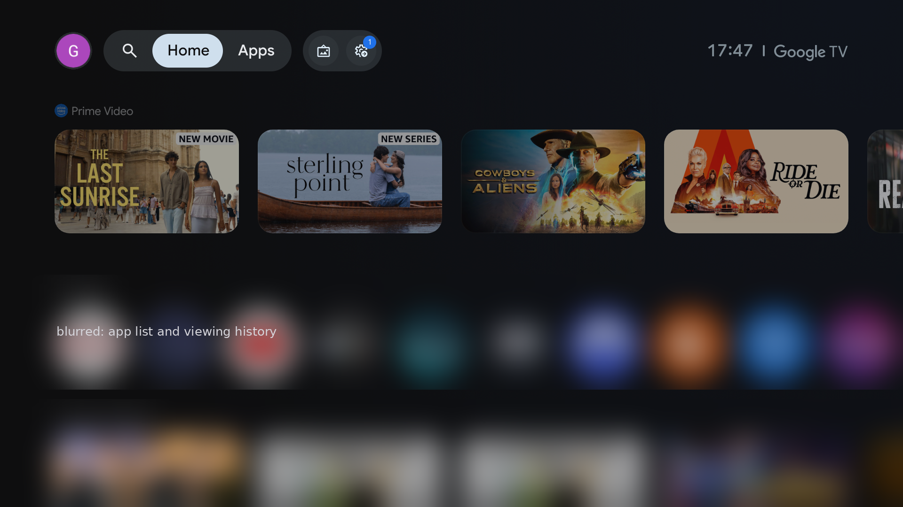
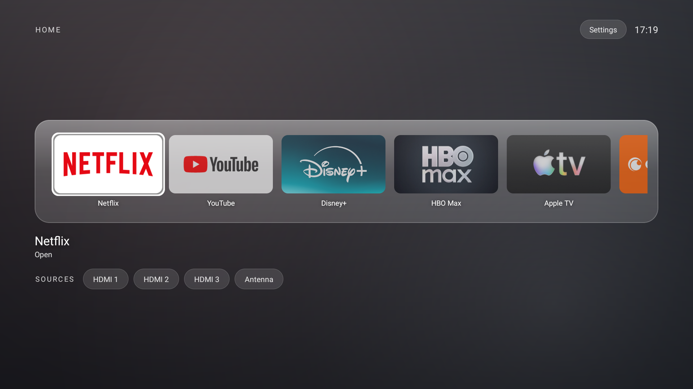
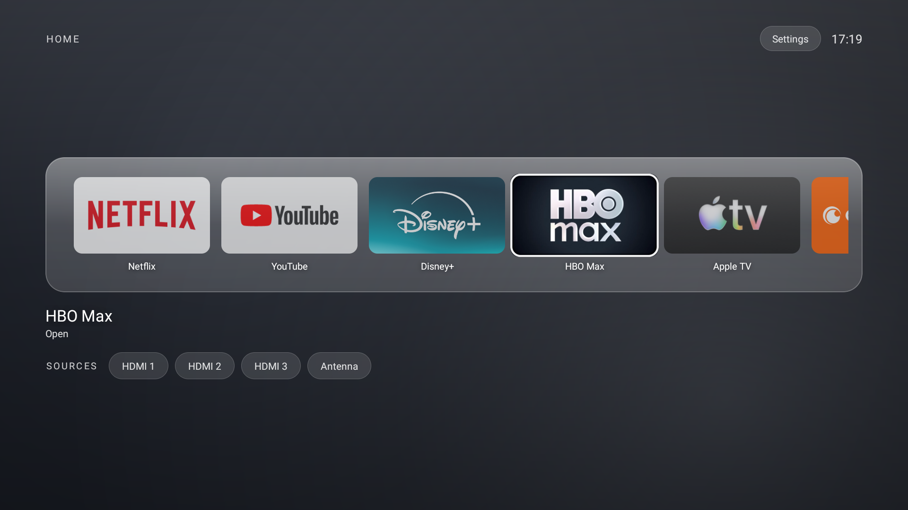
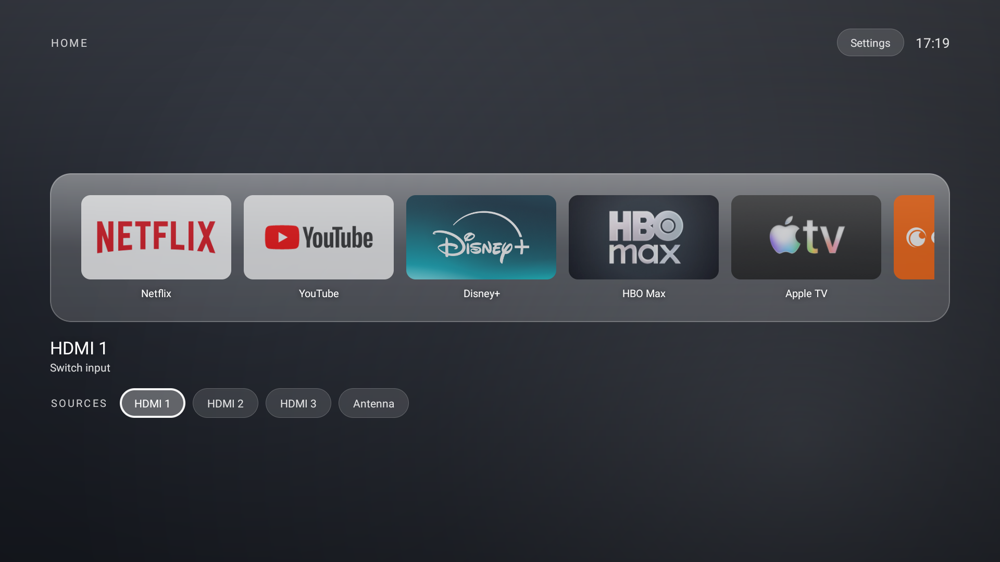
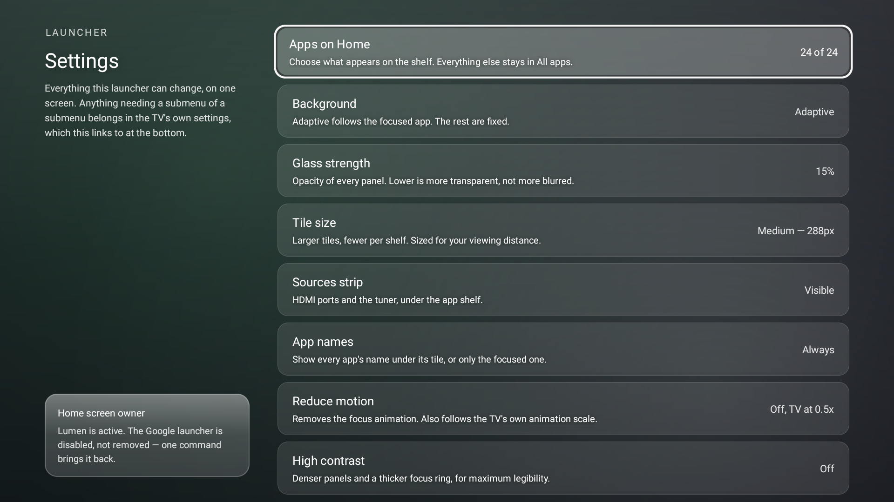
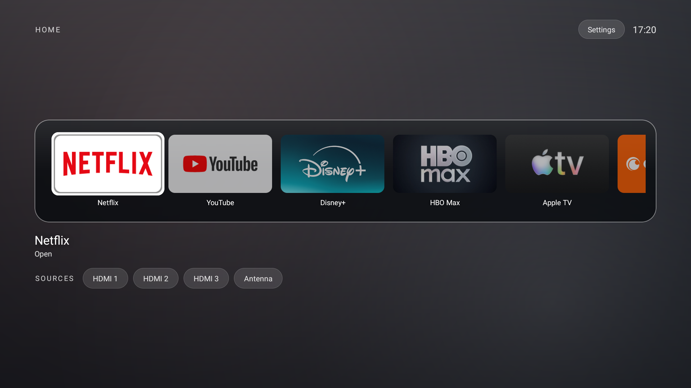
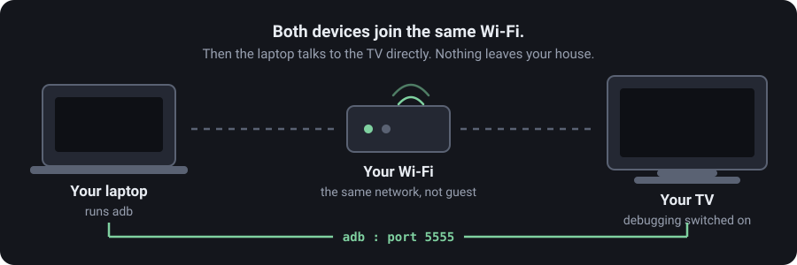

# Lumen

**A calm home screen for Android TV, and the guide to getting your television back.**

No ad rows. No "recommended for you". No content you didn't ask for.
Your apps, your inputs, and nothing else.

---

## Before and after

<table>
<tr>
<td width="50%"> <b>Before.</b> The first thing on the home screen is an advert for something you don't own. Your own apps are the small circles underneath. The two lower rows are blurred here — an installed-app list and a viewing history, neither of which belongs in a public README.</td>
<td width="50%"> <b>After.</b> Your apps, at the size you can actually see from a sofa, with the HDMI inputs one press below. Nothing else.</td>
</tr>
</table>

**This is a real capture, not a mock-up.** To take it, every factory package listed in this repo was switched back on, the television rebooted, and the home screen photographed with everything running. Then it all went off again. Same set, same evening.

Worth knowing what that test showed: re-enabling TCL's own advertising packages **did not change the Home tab at all** — it only restored an extra "TCL" tab in the header. The promotional rows above your apps are Google TV's, not the manufacturer's. Which means debloating alone will not get rid of them. That is the entire reason the launcher exists.

---

## What this is

Two things that work together, and either one is useful on its own.

**A guide** to switching off the advertising, telemetry and factory clutter on an Android TV, using nothing but a laptop and a USB cable's worth of patience. Nothing gets uninstalled — every change is one command away from being undone.

**A launcher** to replace the home screen once the ads underneath it are gone. About 900 lines of plain Java, no frameworks, no analytics, no network access of any kind.

Built and tested on a **TCL Smart TV Pro (Android 11)**. The launcher should work on any Android TV running 8.0 or later. The debloat package list is TCL-specific, but [the method](docs/02-debloat.md) transfers to any brand.

---

## What actually changed

Measured on the test set — a 2 GB TCL that had been running for 33 days.

| | Before | After |
|---|---|---|
| Storage used | **87%** — 1.4 GB free | **39%** — 6.4 GB free |
| Swap in use | 578 MB | 266 MB |
| Available memory | 411 MB | 497 MB |
| Packages disabled | 3 | 51 |
| Home screen | Google TV, with ad rows | Lumen |

**Read that honestly.** The 5 GB of storage is the number to trust — measured before and after a cache clear within the same minute, nothing else changed. The memory figures are muddier, because "before" was 33 days of uptime and "after" was a fresh boot, and a reboot flatters any measurement. The clean memory comparison, taken at identical uptime with no reboot in between, was **+125 MB available**. Most of that was one package: Google's always-resident voice service.

---

## Screenshots

<table>
<tr>
<td width="50%"> <b>Focus.</b> The focused tile lifts, brightens and takes a white ring. Everything else recedes.</td>
<td width="50%"> <b>Sources.</b> Real HDMI ports read from the TV, in port order, one press below the apps.</td>
</tr>
<tr>
<td width="50%"> <b>Settings.</b> Nine of them. Everything else belongs in the TV's own settings.</td>
<td width="50%"> <b>High contrast.</b> Near-black panels, thicker focus ring. Measured, not guessed.</td>
</tr>
</table>

---

## Start here

Three steps, in order. The first one is the only one that needs care.

| | | |
|---|---|---|
| **1** | **[Connect your laptop to your TV](docs/01-connect.md)** | Same Wi-Fi, developer options, debugging, `adb`. About fifteen minutes the first time. |
| **2** | **[Clear out the factory clutter](docs/02-debloat.md)** | What to disable, what never to touch, and how to undo all of it. |
| **3** | **[Install Lumen](docs/03-launcher.md)** | Download, install, set as home. Five minutes. |

Also here: **[the design](docs/04-design.md)** — colours, type, the focus model, how the glass is faked on a TV that cannot blur, and the measured contrast figures. And **[troubleshooting](docs/05-troubleshooting.md)** for when something goes sideways.

---

## Download

**[Download the latest APK from Releases →](../../releases/latest)**

The APK is **debug-signed**. That is normal for something you sideload and build yourself, but it means two things you should know: your TV may warn you about installing it, and it will not update itself. If you would rather not trust a stranger's binary — a reasonable position — [build it yourself](docs/03-launcher.md#build-it-yourself). It takes one command and no Gradle.

---

## What Lumen does not do

Stated plainly, because a list of features tells you less than a list of limits.

- **No content rows, ever.** No continue-watching, no recommendations, no "top picks". Not a missing feature — the whole point.
- **No network access.** The app requests no internet permission. It cannot phone home because it cannot reach anything.
- **No live blur.** Android's blur API arrived in Android 12. On Android 11 the frosted glass is four flat layers that cost nothing per frame. [How and why](docs/04-design.md#glass-without-a-blur-api).
- **No search.** Use the app you want to search in.
- **It will not fix a slow TV on its own.** Removing the launcher's ad machinery helps. A television with 2 GB of RAM still has 2 GB of RAM.

---

## Accessibility

Not an afterthought, and not asserted — measured off the panel with a screenshot and a contrast calculation.

- **Worst text contrast anywhere: 5.04:1**, against a WCAG AA floor of 4.5:1. Zero failures across all four screens.
- **Every focusable element is labelled** for screen readers, verified by dumping the accessibility tree the reader actually consumes.
- **Reduce motion** sets animation duration to zero, not merely shorter, and also obeys the TV's own animation scale.
- **App names are visible by default** under every tile, not only the focused one.

Full numbers, including the two failures the measurement caught and how they were fixed, in [the design doc](docs/04-design.md#accessibility).

---

## A word on the guide

Everything in [the debloat guide](docs/02-debloat.md) uses `pm disable-user`. Nothing is uninstalled. That distinction matters more than it sounds: a disabled package sits there inert and comes back with one command, while an uninstalled system package on a locked-down TV may never come back at all.

The guide also refuses to recommend rooting, unlocking the bootloader, or flashing a custom ROM. On a modern television those can drop Widevine from L1 to L3, which permanently caps Netflix at standard definition. The upside does not justify it.

---

## Licence

MIT. Do what you like with it.
