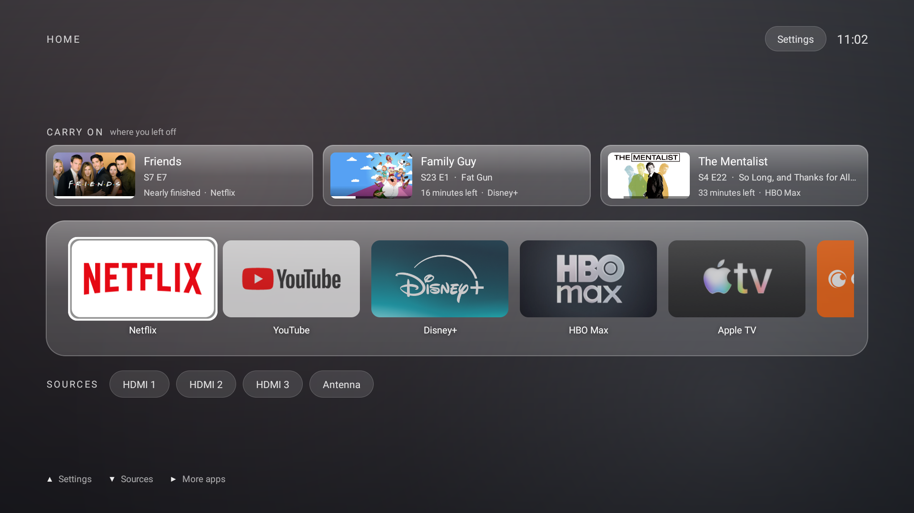
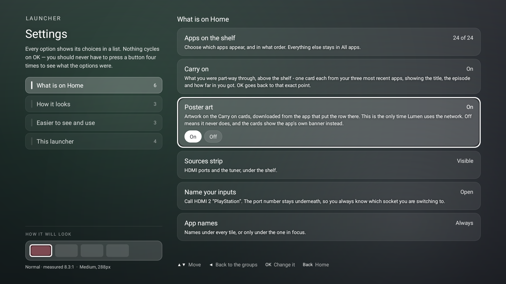
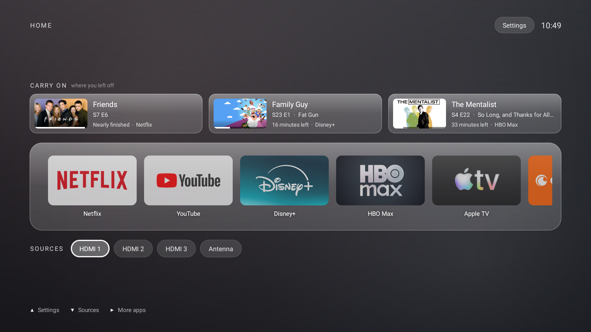
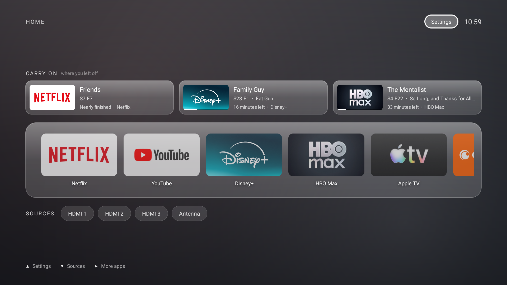
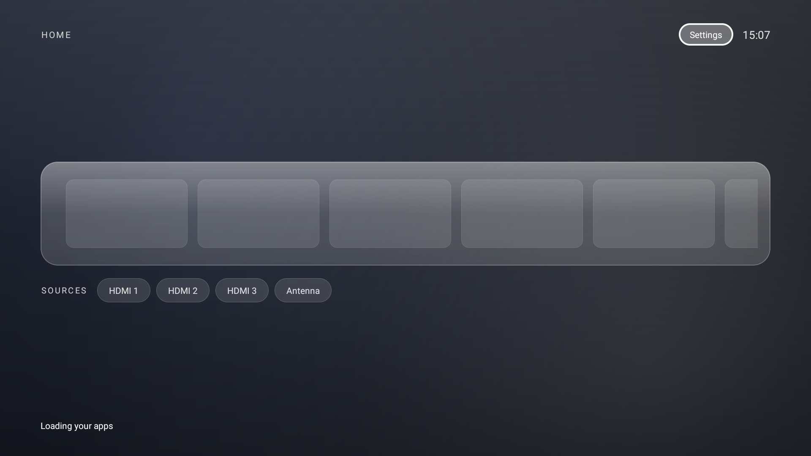
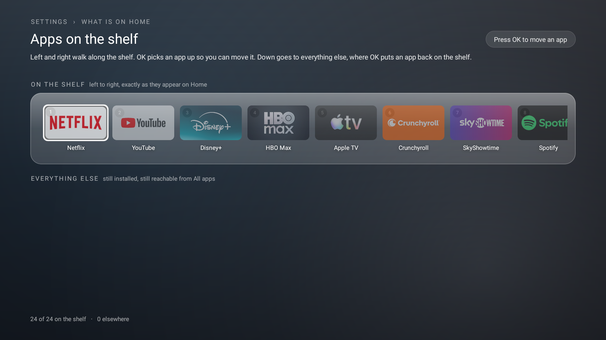
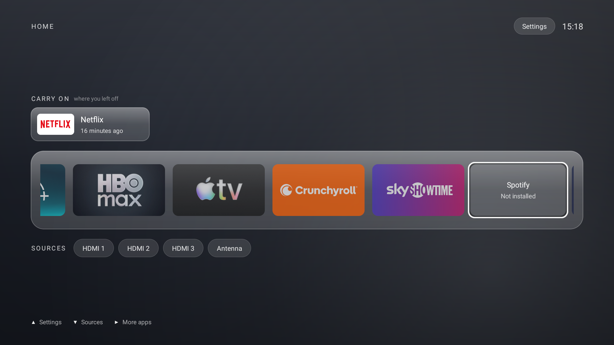
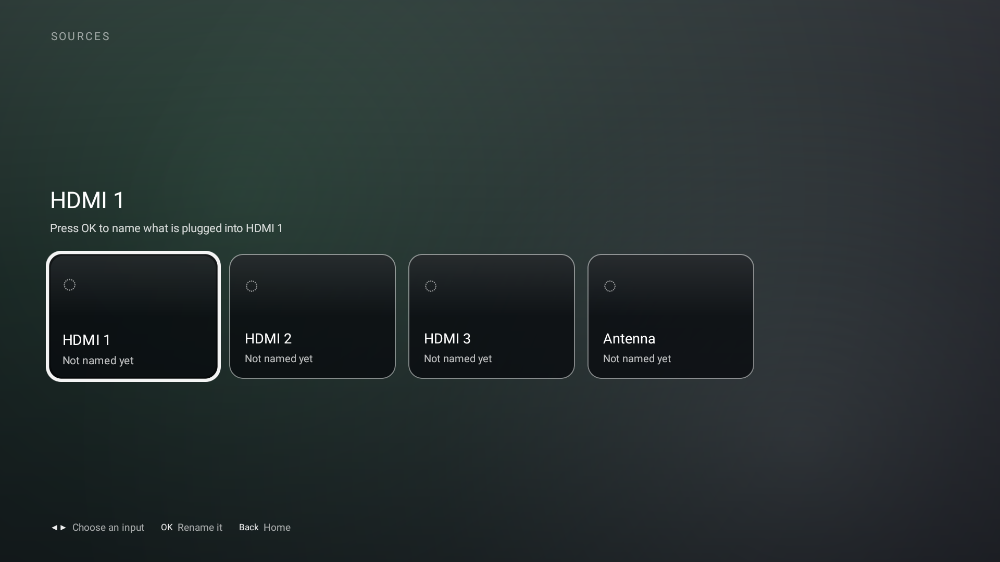
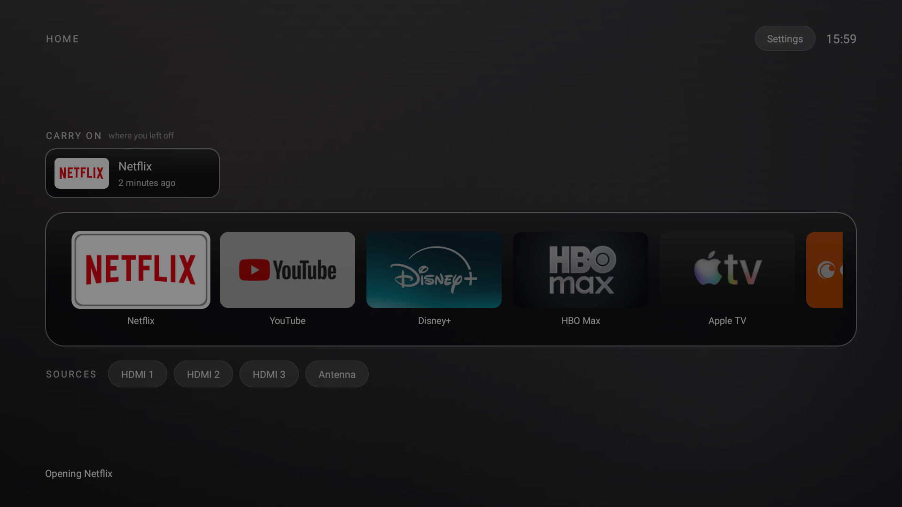
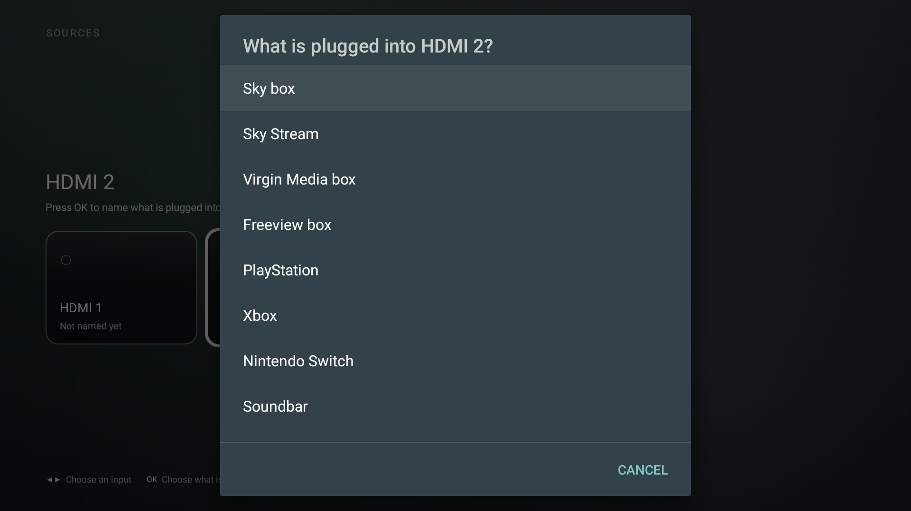

<div align="center">

# Lumen

**A calm home screen for Android TV, and the guide to getting your television back.**

No ad rows. No "recommended for you". No content you didn't ask for.
Your apps, your inputs, and nothing else.


</div>

---

## Before and after

<table>
<tr>
<td width="50%"><br><sub><b>Before.</b> The first thing on the home screen is an advert for something you don't own. Your own apps are the small circles underneath. The two lower rows are blurred here — an installed-app list and a viewing history, neither of which belongs in a public README.</sub></td>
<td width="50%"><br><sub><b>After.</b> Your apps, at the size you can actually see from a sofa, with the HDMI inputs one press below. Nothing else.</sub></td>
</tr>
</table>

**This is a real capture, not a mock-up.** To take it, every factory package listed in this repo was switched back on, the television rebooted, and the home screen photographed with everything running. Then it all went off again. Same set, same evening.

Worth knowing what that test showed: re-enabling TCL's own advertising packages **did not change the Home tab at all** — it only restored an extra "TCL" tab in the header. The promotional rows above your apps are Google TV's, not the manufacturer's. Which means debloating alone will not get rid of them. That is the entire reason the launcher exists.

---

## What this is

Two things that work together, and either one is useful on its own.

**A guide** to switching off the advertising, telemetry and factory clutter on an Android TV, using nothing but a laptop and a USB cable's worth of patience. Nothing gets uninstalled — every change is one command away from being undone.

**A launcher** to replace the home screen once the ads underneath it are gone. About 1,100 lines of plain Java, no frameworks, no analytics, and exactly one thing it fetches from the internet — poster art on the Carry on cards, which is a switch in Settings.


---

## Version 2

The first version was a shelf of apps and nothing else. That was the point, and most of it survives. But a round of research and a set of user flows turned up eight things worth changing — including the one I spent a page of this README explaining was impossible, and then built.

<table>
<tr>
<td width="50%"><br><sub><b>Home.</b> A "Carry on" row above the shelf, ports named by what is plugged into them, and a permanent hint line naming what up, down and right do.</sub></td>
<td width="50%"><br><sub><b>Settings.</b> Nine flat rows became four named groups, and every option shows its values instead of cycling one per press of OK.</sub></td>
</tr>
</table>

### The thing I said could not be built

The headline idea was a resume card: *Slow Horses, Season 4 Episode 2, 31 minutes left.* Resume state is the single most-cited complaint about television home screens, so it looked like the obvious win.

I shipped v2 with a paragraph here explaining why it was impossible. That paragraph was wrong, and it is worth keeping the wrong reasoning visible, because the mistake is an easy one to make twice.

**What I did.** I queried the table from the shell and got nothing:

```
$ adb shell content query --uri content://android.media.tv/watch_next_program
No result found.
```

Then I looked up the permission that guards the whole of TvProvider's EPG data and found it was out of reach:

```
$ adb shell pm list permissions -f | grep -A4 ACCESS_ALL_EPG_DATA
+ permission:com.android.providers.tv.permission.ACCESS_ALL_EPG_DATA
  package:com.android.providers.tv
  protectionLevel:signature|privileged
```

Empty table, privileged permission, case closed. I wrote it up and moved on.

**Both halves of that are wrong.**

`adb shell` runs as the `shell` package. TvProvider scopes rows by their owner, `shell` has never written a watch-next row in its life, and it cannot be granted the permission that would let it see anybody else's. So an empty result from the shell is exactly what you get whether the table holds nothing or eighty-four rows. *It is not evidence about what an app can see.* It is a null measurement I read as a negative one.

And `ACCESS_ALL_EPG_DATA` is not what reading needs. `READ_TV_LISTINGS` is enough, and its protection level is `dangerous` — an ordinary runtime permission, the same class as the microphone. You ask for it, the person says yes, and you can read the table. Lumen holds it and does not hold the privileged one:

```
READ_TV_LISTINGS granted   = true
ACCESS_ALL_EPG_DATA granted = false
rows visible               = 84, across 7 apps
```

**What is actually in there.** Every streaming app on the television writes to it, because writing to it is how they get their own tiles onto Google TV's home screen. Measured on this TV, one row per app, most recent first:

| App | Title | Where you were |
|---|---|---|
| Crunchyroll | Mushoku Tensei S2 E21 | 12 of 23 min |
| SkyShowtime | Berlin Station S1 E3 | 39 of 54 min |
| HBO Max | The Mentalist S4 E22 | 7 of 41 min |
| Prime Video | Sterling Point S1 E1 | queued |
| Apple TV | Silo S3 E1 | next episode |
| Disney+ | Criminal Minds S1 E17 | next episode |
| Netflix | Friends S7 E6 | 20 of 21 min |

Title, episode title, season and episode number, poster art, duration, position, and an `intent_uri` that resumes the exact thing at the exact second. Netflix's is an `intent:` URI straight to `com.netflix.ninja/.MainActivity`; the others are https deep links.

So the Carry on row is what it was supposed to be all along: **the three apps you touched most recently, one card each, showing what you were part-way through.** OK on a card does not open the app — it resumes the episode.

<table>
<tr>
<td width="50%"><br><sub><b>Poster art on.</b> Three apps, three cards, artwork fetched from the URL each app wrote into its own row.</sub></td>
<td width="50%"><br><sub><b>Poster art off.</b> The app's own banner stands in, and Lumen makes no network request at all. Titles, episodes and progress are unchanged, because none of that came from the internet.</sub></td>
</tr>
</table>

The lesson is not about Android. It is that "the command returned nothing" and "there is nothing there" are different sentences, and I let a tool's own lack of permission stand in for a fact about the world. The person I was building this for did not accept it, said their old launcher showed titles, and told me to look harder. They were right.

### What else changed

| | |
|---|---|
| **Carry on row** | Three cards from three different apps: what you were watching, which episode, how far in, and a poster. OK resumes it. Reads the television's own watch-next table. |
| **A hint line that stays** | Up, down and right, named, along the bottom. Not a dismissible first-run tour — the person who needs it is rarely the person who set this up. |
| **The big caption is gone** | The focused app's name no longer repeats in 44px under the shelf. It said what the focus ring already said, and screen readers read it twice. |
| **Ports named by device** | "HDMI 2 · PlayStation 5". The port number stays, so you still know which socket you are switching to. Named from Settings › What is on Home › Name your inputs. |
| **Launching says so** | The tile presses in, the shelf dims, and a line names the app. Replaces a Toast that sighted users missed and the screen reader read over itself. |
| **A shelf during cold start** | Placeholder tiles at final size while banners load, so the layout cannot jump under a press. |
| **Choices in a list** | Four groups; every option shows its values as pills. Cycling on OK hides the option set until you have already pressed past it. **Left goes back to the groups**, OK switches a two-value option or opens a list for a longer one. |
| **Reordering** | Apps on the shelf can be picked up and moved. The held tile lifts, so the same two keys never do two things without saying which. |
| **A pinned app that is gone** | Stays as an outline rather than vanishing. A shelf that quietly reorders itself between boots is what destroys muscle memory. |
| **A notice on first boot** | Plain language for whoever wakes up to a changed television, with the way back given the same weight as the way forward. |
| **Save and load your settings** | A small text file under the app's own folder, to copy to another TV or keep before a factory reset. |

<table>
<tr>
<td width="33%"><br><sub>Cold start.</sub></td>
<td width="33%"><br><sub>Reordering.</sub></td>
<td width="33%"><br><sub>A pinned app that is gone.</sub></td>
</tr>
</table>

### Measured, not asserted

Contrast sampled from screenshots taken off the television itself, not from the palette:

| Element | Ratio |
|---|---|
| Carry on — title | 11.97:1 |
| Carry on — season and episode | 9.44:1 |
| Carry on — how far in, and the app | 8.59:1 |
| "where you left off" subheading | 5.16:1 |
| App name under a tile | 9.35:1 |
| Hint line | 9.60:1 |
| Settings row title and help | 6.49:1 |
| Settings row value | 7.36:1 |
| Clock, Settings pill | 9.87:1, 9.94:1 |
| App name, high contrast on | 18.72:1 |

**Worst measured anywhere: 4.86:1**, against a floor of 4.5:1.

Two elements failed on the way here and were fixed rather than reworded: the "where you left off" subheading measured **3.70:1** and its twin on Apps on the shelf **4.14:1**, both from a resting alpha of 0.46–0.50 that looked fine on a laptop and disappeared on a panel. Raised to 0.60. They had been in the build since v2 shipped, and only turned up because the Carry on rewrite meant re-measuring the row around them — which is an argument for measuring every screen every time, not the ones you changed.

Every focusable stop on Home, Settings and Apps on the shelf carries a label — `uiautomator` reports 0 unlabelled across all three.

### Naming an input

<table>
<tr>
<td width="50%"><br><sub><b>Settings › What is on Home › Name your inputs.</b> A card per port. OK opens a list.</sub></td>
<td width="50%"><br><sub><b>Opening an app.</b> The tile presses in, the shelf dims, the line names the app. Captured with the system transition slowed; Lumen's own animation setting was untouched.</sub></td>
</tr>
</table>

OK opens a list, not a keyboard.



This took four attempts, and the first three are worth recording because they are all the same mistake in different clothes.

A dialog with a text field is a trap on a television. Once the field has focus the on-screen keyboard owns the D-pad, so **down and right never reach the Save button** — measured on the TV, both directions, twice. Committing on the keyboard's Done key fixes typing, but Done does not fire on an *empty* field, and an empty field was how you removed a name. Closing the keyboard with Back does free the D-pad to reach Save, so the dialog was usable — by a route nobody would guess.

The answer was to stop asking for text. Almost everything plugged into a television is one of a dozen things, so picking one is a single press with no keyboard at all. Typing is still there for the thirteenth case, and removing a name is its own item rather than a trick involving an empty box. The tuner gets its own list — Freeview, Freesat, aerial, satellite, cable — because "what is plugged into the antenna socket" is a different question.

### What using it changed

The first build of this screen spent left and right on changing values. That left the way *out* of an option list with nowhere to go but up from the first row — which nobody guesses, and which is not how any other television menu on earth behaves. Left is back. It is not negotiable and it should not have taken being told.

So the controls moved: **left always returns to the groups**, and **OK acts** — a two-value option switches in one press, because both values are already on screen and making a switch cost three presses to satisfy a navigation rule is a bad trade; anything longer opens a list with the current value marked.

Two smaller things came out of the same look:

**The panel bottom-left could not be focused, and looked like it should be.** It wore the same rounded plate and border as the group rows above it — a promise the screen cannot keep, because there is nothing to press. It is a rule and a caption now, and reads as the legend it always was.

**The selected group was not distinct enough.** Selected and merely-focused differed by about 14% white, which is invisible from a sofa. Three states now differ three ways: a bright accent bar down the leading edge marks the group whose options are showing and survives focus moving away, the focus ring marks where the cursor is, and the plate lifts under both.

### Three bugs worth naming

They cost hours, and all three are the kind that look like they cannot possibly be the problem.

**A key collision took the launcher down on every OK press.** `Prefs` stored the on/off switch for the Carry on row as a boolean under `"recents"`; `Recents` stored its list as a string under the same key in the same preferences file. Reading one as the other threw `ClassCastException` and killed the process before the launch could run.

**One app filled the whole screen.** With app names set to "Focused only", the wrapper function returns the tile itself rather than a column — and the next line overwrote the tile's fixed size with `WRAP_CONTENT`, letting it inflate to its banner's intrinsic size. Latent in v1 too.

**All apps was the odd one out.** Launching from it left no trace in Carry on, gave no feedback, and reported failure through a Toast — the exact thing the home screen had stopped doing. Opening an app is opening an app, wherever you pressed OK.

**The settings groups were unreachable by remote.** They were clickable but never focusable, and the option rows swallow left and right to change values. Nothing could move focus into the list. Up from the first option now goes there.


Built and tested on a **TCL Smart TV Pro (Android 11)**. The launcher should work on any Android TV running 8.0 or later. The debloat package list is TCL-specific, but [the method](docs/02-debloat.md) transfers to any brand.

---

## What actually changed

Measured on the test set — a 2 GB TCL that had been running for 33 days.

| | Before | After |
|---|---|---|
| Storage used | **87%** — 1.4 GB free | **39%** — 6.4 GB free |
| Swap in use | 578 MB | 266 MB |
| Available memory | 411 MB | 497 MB |
| Packages disabled | 3 | 51 |
| Home screen | Google TV, with ad rows | Lumen |

**Read that honestly.** The 5 GB of storage is the number to trust — measured before and after a cache clear within the same minute, nothing else changed. The memory figures are muddier, because "before" was 33 days of uptime and "after" was a fresh boot, and a reboot flatters any measurement. The clean memory comparison, taken at identical uptime with no reboot in between, was **+125 MB available**. Most of that was one package: Google's always-resident voice service.

---

## Screenshots

<table>
<tr>
<td width="50%"><br><sub><b>Focus.</b> The focused tile lifts, brightens and takes a white ring. Everything else recedes.</sub></td>
<td width="50%"><br><sub><b>Sources.</b> Real HDMI ports read from the TV, in port order, one press below the apps.</sub></td>
</tr>
<tr>
<td width="50%"><br><sub><b>Settings.</b> Nine of them. Everything else belongs in the TV's own settings.</sub></td>
<td width="50%"><br><sub><b>High contrast.</b> Near-black panels, thicker focus ring. Measured, not guessed.</sub></td>
</tr>
</table>

---

## Start here

Three steps, in order. The first one is the only one that needs care.

| | | |
|---|---|---|
| **1** | **[Connect your laptop to your TV](docs/01-connect.md)** | Same Wi-Fi, developer options, debugging, `adb`. About fifteen minutes the first time. |
| **2** | **[Clear out the factory clutter](docs/02-debloat.md)** | What to disable, what never to touch, and how to undo all of it. |
| **3** | **[Install Lumen](docs/03-launcher.md)** | Download, install, set as home. Five minutes. |

Also here: **[the design](docs/04-design.md)** — colours, type, the focus model, how the glass is faked on a TV that cannot blur, and the measured contrast figures. And **[troubleshooting](docs/05-troubleshooting.md)** for when something goes sideways.


---

## Download

**[Download the latest APK from Releases →](../../releases/latest)**

The APK is **debug-signed**. That is normal for something you sideload and build yourself, but it means two things you should know: your TV may warn you about installing it, and it will not update itself. If you would rather not trust a stranger's binary — a reasonable position — [build it yourself](docs/03-launcher.md#build-it-yourself). It takes one command and no Gradle.

---

## What Lumen does not do

Stated plainly, because a list of features tells you less than a list of limits.

- **No recommendations, ever.** No "top picks", no trending, no sponsored tile, nothing chosen for you by anyone. The Carry on row is the one exception to an otherwise empty screen, and it is not a recommendation: every card is something *you* started watching, and there are exactly three. Nobody paid for a slot in it, and nobody can.
- **No network access, except poster art.** Lumen holds `INTERNET` for exactly one purpose: fetching the artwork on the Carry on cards, from the URL the streaming app itself put in the watch-next row. Nothing is sent — no analytics, no identifiers, no phoning home. Settings › What is on Home › **Poster art › Off** stops every request at the source, and the cards fall back to each app's own banner with the title, episode and progress intact, since all of that is already on the device.
- **No live blur.** Android's blur API arrived in Android 12. On Android 11 the frosted glass is four flat layers that cost nothing per frame. [How and why](docs/04-design.md#glass-without-a-blur-api).
- **No search.** Use the app you want to search in.
- **It will not fix a slow TV on its own.** Removing the launcher's ad machinery helps. A television with 2 GB of RAM still has 2 GB of RAM.

---

## Accessibility

Not an afterthought, and not asserted — measured off the panel with a screenshot and a contrast calculation.

- **Worst text contrast anywhere: 5.04:1**, against a WCAG AA floor of 4.5:1. Zero failures across all four screens.
- **Every focusable element is labelled** for screen readers, verified by dumping the accessibility tree the reader actually consumes.
- **Reduce motion** sets animation duration to zero, not merely shorter, and also obeys the TV's own animation scale.
- **App names are visible by default** under every tile, not only the focused one.

Full numbers, including the two failures the measurement caught and how they were fixed, in [the design doc](docs/04-design.md#accessibility).

---

## A word on the guide

Everything in [the debloat guide](docs/02-debloat.md) uses `pm disable-user`. Nothing is uninstalled. That distinction matters more than it sounds: a disabled package sits there inert and comes back with one command, while an uninstalled system package on a locked-down TV may never come back at all.

The guide also refuses to recommend rooting, unlocking the bootloader, or flashing a custom ROM. On a modern television those can drop Widevine from L1 to L3, which permanently caps Netflix at standard definition. The upside does not justify it.

---

## Licence

MIT. Do what you like with it.
