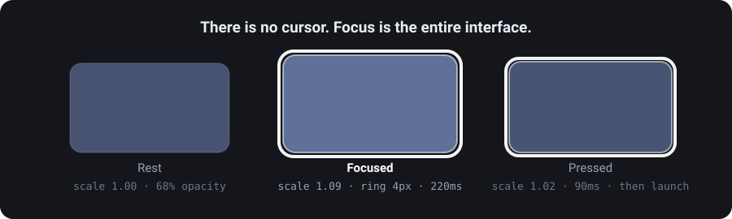

# 4. The design

What it looks like, why, and the parts that were harder than they look.

---

## The idea

A television home screen should show you the things you own and then get out of the way. Everything here follows from that.

- **One row.** Your apps, in the order you choose, not alphabetical and not ranked by whoever paid.
- **No content rows.** No recommendations, no continue-watching, no "because you watched". A launcher that suggests things is a launcher with an opinion about what you should do next.
- **The inputs are first-class.** HDMI ports sit one press below the apps, not three menus deep.
- **Names always visible.** Recognising a logo at ten feet is a test nobody should have to pass.

---

## Palette

Deliberately dark, and not for taste. White text over a light glass panel over a light background cannot meet contrast requirements no matter what you do to the text. The background is what makes the rest legible.

| Role | Value | Where |
|---|---|---|
| Ground | `#14161C` | The base behind everything |
| Bloom | derived from the focused app's artwork | Two soft radial washes, clamped so they can never get bright enough to fail contrast |
| Glass fill | white at 15% | Every panel |
| Glass edge | white at 28%, 1.5px | Panel borders |
| Lit top edge | white 30% → transparent | The detail that reads as thickness |
| Focus ring | white at 95%, 4px, over a dark outer line | Every focused element |
| Text — primary | white 100% | Headings, focused values, names on glass |
| Text — secondary | white 86% | Body, help text |
| Text — tertiary | white 78% | Labels, kickers |

The focus ring is **two strokes, not one**: a dark line under a white line. A plain white ring vanishes against white artwork — Netflix's banner, for one.

Type is [Instrument Sans](https://fonts.google.com/specimen/Instrument+Sans) in the design files. The build uses the system face, because shipping a font into a 30 KB APK for a launcher is not a trade worth making.

---

## The focus model

Five rules, and they are most of the difference between something that feels bought and something that feels homemade.

1. **Focus is remembered per row.** Drop to the Sources strip and come back, and you return to the tile you left — not to the start.
2. **Edges absorb, never wrap.** Right on the last tile does nothing. Wrapping is disorienting when you cannot see the whole row.
3. **One easing curve** — `cubic-bezier(.2,.7,.2,1)` — at 220ms, everywhere.
4. **A held D-pad does not animate.** Fast scrolling with an animation on every step looks broken.
5. **Three zones only.** Top bar, shelf, sources. A fourth row is where this stops being calm.

### The bug worth knowing about

The focused tile is raised with `translationZ`, never `bringToFront()`. In a `LinearLayout`, `bringToFront()` doesn't just change draw order — it **moves the child to the end of the row**. During development that produced a launcher where every tile you focused teleported to the end of the shelf, focus chased it there, and then bounced between the final two forever. It looked like broken scrolling. The row was rearranging itself.

Focus traversal is also an **explicit ID chain** rather than Android's geometric focus search. Geometry gets unreliable once children are scaled and z-translated inside a scrolling container.

---

## Glass without a blur API

The look is frosted glass. The television cannot do frosted glass.

`RenderEffect.createBlurEffect` and `Window.setBackgroundBlurRadius` both arrived in **Android 12, API 31**. This was built for **Android 11, API 30**. RenderScript still exists on 11, but Google deprecated it in 12, manufacturers had already stopped hardware-accelerating it, and running a full-screen blur through it on a 2 GB Realtek panel would be visibly bad.

So the glass is faked, in four flat layers that cost nothing per frame:

| Layer | What it is |
|---|---|
| **1. Ground** | Layered radial gradients, drawn once. Never blurred at runtime. |
| **2. Translucent fill** | A flat white at 15%. This is what reads as the pane. |
| **3. Lit top edge** | 1px, white 75% fading to nothing. **The most convincing detail** — a lit top edge is what your eye reads as thickness. |
| **4. Cast shadow** | Elevation, to lift the pane off the ground. |

**What's lost:** real glass refracts whatever moves behind it; this refracts a still image. On a launcher whose background never moves, that difference is invisible. It's also why the launcher never puts glass over playing video — the one place the trick would show.

---

## Accessibility

Measured off the panel with a screenshot and a contrast calculation, not asserted from the palette.

| Screen | Worst element | Measured | AA floor |
|---|---|---|---|
| Home | HOME, top bar, 21px | **7.93:1** | 4.5 |
| Settings | Row title, 26px | **5.04:1** | 4.5 |
| Apps on Home | "On Home" on glass, 19px | **5.60:1** | 4.5 |
| All apps | App name on glass, 19px | **5.95:1** | 4.5 |

**Worst case anywhere: 5.04:1. Zero failures.**

### Two failures the measurement caught

**Tile names measured 4.41:1** — 86% white on the glass panel, just under the floor. Raised to full white with a shadow: 8.30:1.

**High contrast mode made contrast worse — 3.36:1.** It was raising panel opacity *toward white*, which lightens the surface under white text. Exactly backwards. Inverted to darken the panel to near-black: 17.53:1.

Neither would have been caught by looking. Both looked fine.

### Screen reader

Verified by dumping the accessibility tree the reader actually consumes, not by inspecting the code.

- **Every focusable node is labelled**, on every screen.
- Artwork inside a tile is excluded, so nothing is announced twice.
- Source pills announce "HDMI 1, switch input". Settings rows announce title, value, then explanation.
- Toggling an app announces what changed — the only other feedback is visual.
- Scroll containers were removed from the focus order; each was a focusable, unlabelled dead stop.

### Motion

**Reduce motion sets duration to zero**, not merely shorter. It also reads the TV's own animation scale and obeys it — a launcher cannot write that system setting without a permission only system apps get, but it can read it.

---

## Screens

| | |
|---|---|
|  | **Sources.** Read from `TvInputManager` at launch — real HDMI ports in port order, then the tuner. A port with nothing plugged in stays listed rather than vanishing; a disappearing HDMI port is how people conclude the launcher is broken. |
|  | **Settings.** Nine rows. The last one hands off to the TV's own settings, because picture and sound are not this launcher's business. |
|  | **High contrast.** Near-black panels, 6px ring. 17.53:1 on tile names. |
